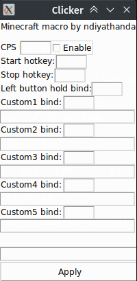

# Auto Clicker
Clicker made for minecraft pvp. Tested on Linux only.

# Screenshots

# Example keybinds
 
shift + s
 
ctrl + r
 
ctrl + space
 
k
 
IMPORTANT
 
Dont use ctrl + 4 as keybind bcs it close program(on Linux). 

# Early Access
This software is still in the early access and can be bugged!
## Changelog
# Version 0.1.1
Now you can save your config.
 
Once clicker starts it loads config from config.txt file
 
Fixed custombind 4 bug
